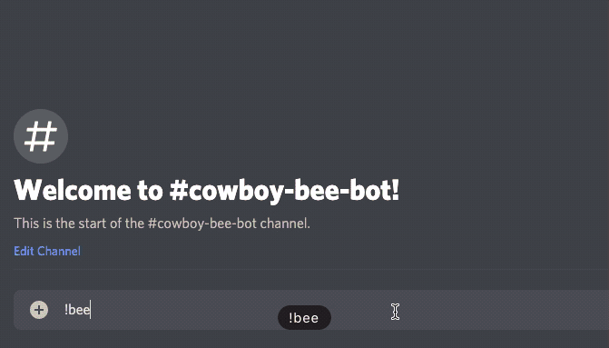

# Cowboy Bee Bot
I built this bot for fun and for learning purposes. This is my very first Discord bot. (woo)

Cowboy Bee Bot is a bot that loves bees. They’re happy to tell you a random bee-related fact and will even show you a random bee gif, all you need to do is ask!

### Demo
---

### Frameworks & Libraries
---
- [Discord.js](https://discord.js.org/#/)

### APIs & SDKs Used
---
- [Giphy/giphy-js-sdk-core](https://github.com/Giphy/giphy-js-sdk-core)

### Current Commands:
---
##### Prefix: !
- args-info: info about arguments entered by user
- bee: your gateway to sweet, sweet, bee facts
- help: slides into your DMs with a list of commands
- kick: forcibly ejects a tagged member from the server
- ping: responds with “pong”… so, that’s fun
- server: provides server information, if you're into that sort of thing
- user-info: provides info about a specific user

### Sources:
---
- [Bee Facts](https://honeybeenet.gsfc.nasa.gov/Honeybees/Basics.htm)

